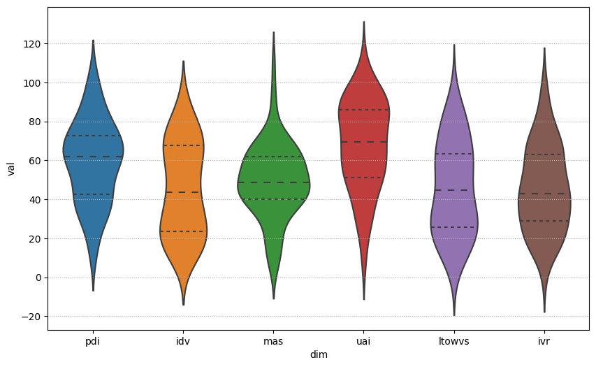
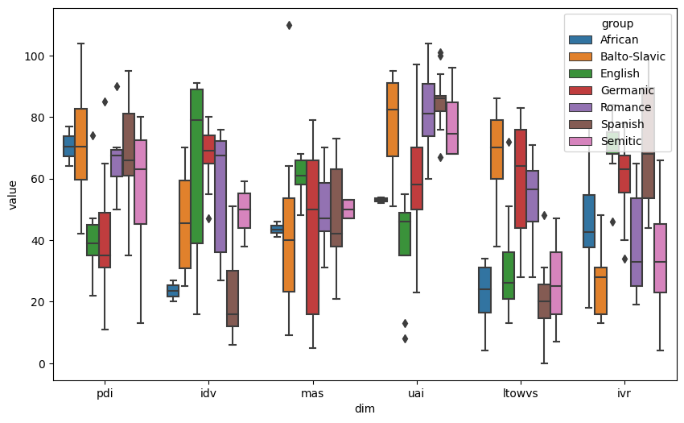
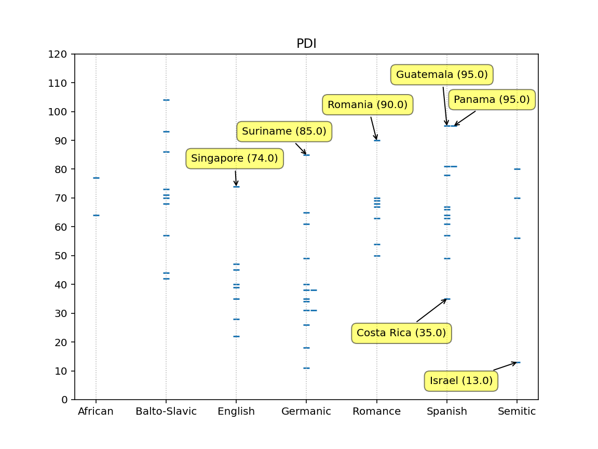
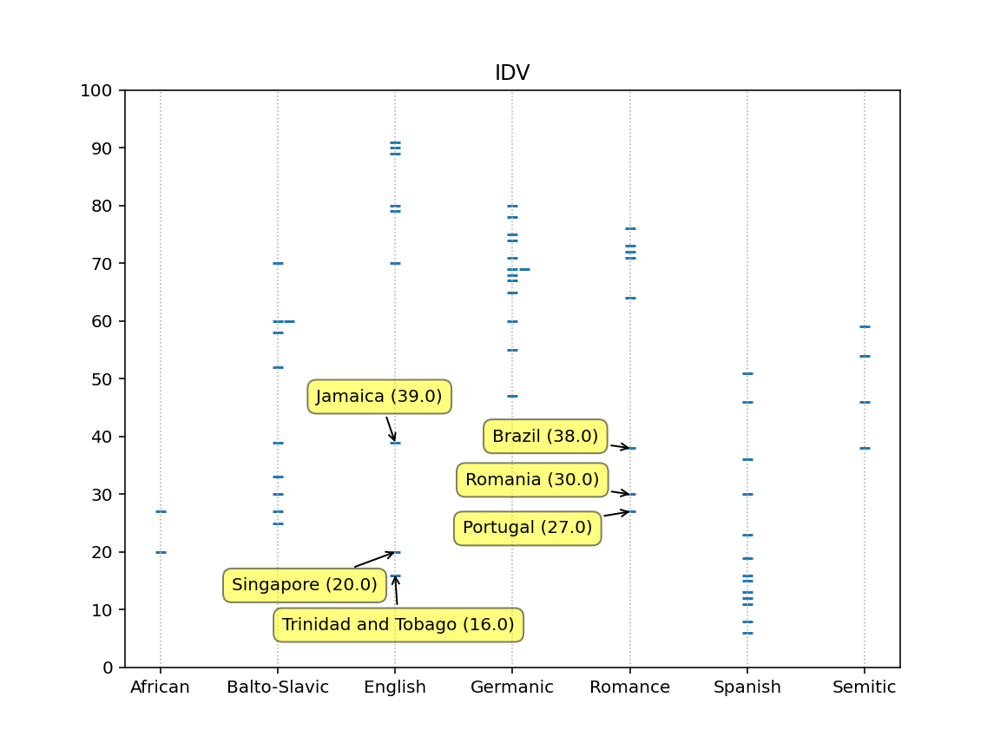
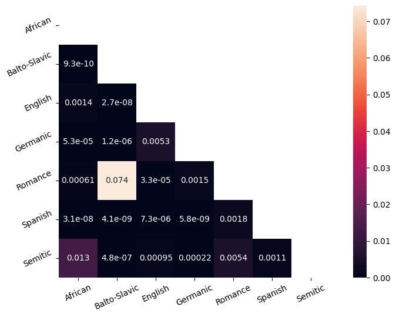

Aren't Languages Enough?
===

Jaroslav Langer

Abstract
---

I am exploring possibility of approximation Hofstede's cultural dimensions using the country's language.
Because of the dimensions' dataset size I use custom language groups instead of languages itself.
As a statistical model I chose Gaussian Naive Bayes.
For evaluation I used Matthews correlation coefficient.

**Keywords**: Hofstede; Cultural Dimensions; Naive Bayes; Language Families.

Introduction
---

In 1991 Richard Franke, Geert Hofstede and Michael Bond wrote that "(Cultural indices) explain more than 50 percent of the international differences in economic growth"[Franke 1991].
How can a culture play such a vital role in a country's development?
One explanation can come from Mancur Olson, Jr.
He divides it into marketable i.e. "personal culture" such as skills and public good i.e. "civic culture" that affects one's income only by influencing public policies and institutions[Olson 1996].
In other words a person's culture  impacts directly his/her life, and also cumulatively and indirectly impacts fellow citizens' lives through institutions.
Measuring a culture is undeniably an intricate matter.
Fortunately Geert Hofstede iterated on his research of cultural dimensions until the 3rd edition of Cultures and Organizations[Hofstede 2010].
In this book we are given 6 time-proven and curated cultural dimensions.
What is more, for research purposes Geert freely distributes the full dataset [geerthofstede.com].
The only downside is, the dataset is from 2015 and what is even worse, quite some values are missing.
This leads to the question: do we need all six dimensions for useful insights?
More specifically can we use a language as an effective proxy to these dimensions?

**Hypothesis**: Language is a sufficient statistic of Hofstede cultural dimensions.

**Verification criteria**: Gaussian Naive Bayes can correctly classify 95% countries' languages based on their cultural dimension values.

Theoretical Part
---

Let's start with a simple question: what is a culture?
Sir Edward Burnett Tylor, a tycoon of anthropology, defines it as "Culture . . . is that complex whole which includes knowledge, belief, art, morals, law, custom, and any other capabilities and habits acquired by man as a member of society"[Tylor 1871].
Is it reasonable to think a culture could be approximated with just a language?
Noah Chomsky considers language to be a "The Mirror of the Mind"[Chomsky 2004].
Some go even further to say, the language is a mirror to the culture [Kadarisman 2009].
Luckily we do not need to approximate culture in its eternity.
Hofstede's 6 dimensions don't do it either.
He said himself that "CULTURE DOESN’T EXIST.
In the same way values don’t exist, dimensions don’t exist.
They are constructs, which have to prove their usefulness by their ability to explain and predict behavior"[Hofstede 2002].
Let's test the following.
If the cultural dimensions of most of the countries will predict the country's language.
Then instead of testing casualties from culture to some effect, it could potentially be reduced to language to effect relation.
On top of that, according to Brown "A language is a part of a culture, and a culture is a part of a language: the two are intricately interwoven so that one cannot separate the two without losing the significance of either language or culture"[Brown 1994.].
Just to state it clearly, here, we do not test whether language causes cultural dimensions.
Rather I test whether the connection of these two is tight enough, so one can be approximate with the other.

Sadly, there is one more setback in the number of data points measured.
In total, there are 111 entries in the dataset.
For simplicity I will assume the dimensions to be independent one on another, which is not completely true.
Nevertheless, assuming 6 independent dimensions it is reasonable to test whether they are normally distributed.
For this purpose I will use both Anderson–Darling and Kolmogorov–Smirnov normality tests.
However to be reasonably conservative I still need at least 10 observations for each language, to moderately estimate its cultural dimensions' distribution.
In order to satisfy this I chose to group languages together by their families.
This choice was made in a way of low hanging fruit without further examination.
Assuming the dimensions' distributions to be normal it makes sense to test if the language dimensions have significantly different expected values (means).
I don't need all pairs to have significantly different means in all dimensions.
It should be sufficient for each pair of languages to have a significantly different expected value in at least one dimension.
In order to examine this I will use Welch's t-test.
Success would be if I reject the null hypothesis for each pair of languages in some dimension.
Having independent normally distributed and separable exogenous variables, it should be possible to fit the Gaussian Naive Bayes model with perfect scores.

$$
{\displaystyle p(x=v\mid C_{k})={\frac {1}{\sqrt {2\pi \sigma _{k}^{2}}}}\,e^{-{\frac {(v-\mu _{k})^{2}}{2\sigma _{k}^{2}}}}}
$$

As I have already made some false assumptions, I do not expect to have perfect results.
In order to evaluate them, I will use a confusion matrix that shows the false estimations.
As a decision metric I will use the Matthews correlation coefficient.
In case it's value will be over 95% the language approximation for cultural dimensions will be in my eyes sufficient.
As it goes in the notoriously famous aphorism attributed to George Box "All models are wrong, but some are useful".

Practical Part
---

**Data Overview**

| Column  | Not Null |
| ------- | -------- |
| country | 111      |
| pdi     |  78      |
| idv     |  78      |
| mas     |  78      |
| uai     |  78      |
| ltowvs  |  96      |
| ivr     |  97      |

A lot of values are missing.

**Test of Normality**

| dim    |   ks test |     ad test |
|:-------|----------:|------------:|
| pdi    | 0.548837  | 0.503694    |
| idv    | 0.0357113 | 0.000591842 |
| mas    | 0.268814  | 0.15928     |
| uai    | 0.0384659 | 0.0495701   |
| ltowvs | 0.0215968 | 0.00959888  |
| ivr    | 0.495077  | 0.13018     |

Individuality, Uncertainty Avoidance and Long-term Orientation have all very low p-value.
It is possible to reject it's normality. However we need to assume it for further steps, so let's just keep it in mind.

**Language Groups**

| Language Group    | Count   |
|:------------------|--------:|
| Spanish           |      15 |
| Germanic          |      15 |
| Balto-Slavic      |      15 |
| African           |      12 |
| Romance           |      10 |
| English           |      10 |
| Semitic           |       9 |
| ----------------- |         |
| Indo-Iranian      |       4 |
| Palaeo-Balkan     |       3 |
| Turkic            |       3 |
| Sino-Tibetan      |       3 |
| Uralic            |       3 |
| Malayo-Polynesian |       3 |

The groups were chosen in a way. That first I took language families.
Then as the Germanic and Romance families were bigger than needed (and others) I separated the English and Spanish as separate groups.

For details about the countries used and their languages see appendix.

**Outliers Detection**

**Pair-wise T-test**

There is no dimensions in which the Balto-Slavic and Romance groups have significantly (5%) different expected value.
Let's keep it in mind, and ignore it.

**Confusion Matrix**

|              |   African |   Balto-Slavic |   English |   Germanic |   Romance |   Semitic |   Spanish |
|:-------------|----------:|---------------:|----------:|-----------:|----------:|----------:|----------:|
| African      |        12 |              0 |         0 |          0 |         0 |         0 |         0 |
| Balto-Slavic |         0 |             13 |         0 |          0 |         2 |         0 |         0 |
| English      |         0 |              0 |        10 |          0 |         0 |         0 |         0 |
| Germanic     |         0 |              0 |         0 |         13 |         0 |         0 |         0 |
| Romance      |         0 |              2 |         0 |          2 |         7 |         1 |         1 |
| Semitic      |         0 |              0 |         0 |          0 |         0 |         8 |         0 |
| Spanish      |         0 |              0 |         0 |          0 |         1 |         0 |        14 |

For details about the confusions and it's probabilities see appendix.

**Matthews correlation coefficient**

$$MCC = 0.878$$

Conclusion
---

It is possible to predict most of the language groups correctly using the Gaussian Naive Bayes classifier.
It is not convincing to me that the cultural dimensions should be approximated with language.
Especially taking into consideration that the work was done on language groups, not languages itself.
Or the other way around I think the dimensions should be preferred whenever possible.
On the other hand, some interesting insights were obtained.
One of the biggest surprises might be the big swap.
Which happened as "misclassification" of Spain into Romance group and the misclassification of Portugal into Spanish group.
In terms of further research.
Different language groups could be constructed.
Nevertheless I believe there are just not enough data in the published dataset to find some buried gold.
To sum it up, language (group) contains some information about the cultural dimensions of countries who speak it.
The degree and usefulness of this information depends on one's particular needs.

References
---

* Brown, H. D. 1994. Principles of Language Learning and Teaching (3rd edn). Englewood Cliffs, NJ: Prentice Hall Regents.
* Franke, Richard H., et al. 1991. Cultural Roots of Economic Performance: A Research Note.” Strategic Management Journal, vol. 12 JSTOR, http://www.jstor.org/stable/2486647. Accessed 17 Jan. 2023.
* Hofstede, G. 2002. Dimensions Do Not Exist: A Reply to Brendan McSweeney. Human Relations, 55(11), 1355–1361. https://doi.org/10.1177/00187267025511004
* Hofstede, Geert H., et al. 2010. Cultures and Organizations: Software of the Mind: Intercultural Cooperation and Its Importance for Survival. 3rd ed, McGraw-Hill.
* Kadarisman, Achmad Effendi. 2009. “THE “LANGUAGE IS A MIRROR” METAPHOR AND ITS IMPLICATIONS ON FOREIGN LANGUAGE TEACHING.”
* Neil Smith. 2004, pp. 6–45. “The Mirror of the Mind.” Chomsky: Ideas and Ideals. 2nd ed., Cambridge University Press, Cambridge.
* Olson, Mancur. 1996. "Distinguished Lecture on Economics in Government: Big Bills Left on the Sidewalk: Why Some Nations Are Rich, and Others Poor." Journal of Economic Perspectives, 10 (2): 3-24.
* Tylor EB. 1871. Primitive Culture.
* “The Dimension Scores in the Hofstede Model of National Culture Can Be Downloaded Here.” Geert Hofstede, https://geerthofstede.com/research-and-vsm/dimension-data-matrix/. Accessed 17 Jan. 2023.

Apendix
---

**Languages**

| Country                | Language                  | Group        |
|:-----------------------|:--------------------------|:-------------|
| Africa East            | Niger–Congo               | African      |
| Uganda                 | English, Arabic           | African      |
| Tanzania               | Kiswahili or Swahili      | African      |
| South Africa           | African                   | African      |
| Rwanda                 | Kinyarwanda               | African      |
| Mali                   | French, Bambara           | African      |
| Zambia                 | African                   | African      |
| Ghana                  | Asante, Ewe, Fante, Boron | African      |
| Ethiopia               | Oromo, Amharic            | African      |
| Burkina Faso           | African                   | African      |
| Zimbabwe               | African                   | African      |
| Africa West            | Niger–Congo               | African      |
| Latvia                 | Latvian, Russian          | Balto-Slavic |
| North Macedonia        | Macedonian, Albanian      | Balto-Slavic |
| Montenegro             | Serbian, Montenegrin      | Balto-Slavic |
| Poland                 | Polish                    | Balto-Slavic |
| Russia                 | Russian                   | Balto-Slavic |
| Serbia                 | Serbian                   | Balto-Slavic |
| Slovakia               | Slovak                    | Balto-Slavic |
| Slovenia               | Slovene                   | Balto-Slavic |
| Czechia                | Czech                     | Balto-Slavic |
| Belarus                | Slavic                    | Balto-Slavic |
| Bulgaria               | Bulgarian                 | Balto-Slavic |
| Bosnia and Herzegovina | Balto-Slavic              | Balto-Slavic |
| Ukraine                | Ukrainian, Russian        | Balto-Slavic |
| Croatia                | Croatian                  | Balto-Slavic |
| Lithuania              | Lithuanian                | Balto-Slavic |
| Australia              | English                   | English      |
| Jamaica                | English                   | English      |
| Ireland                | English                   | English      |
| New Zealand            | English                   | English      |
| United Kingdom         | English                   | English      |
| Nigeria                | English                   | English      |
| Canada                 | English                   | English      |
| United States          | English                   | English      |
| Singapore              | English                   | English      |
| Trinidad and Tobago    | English                   | English      |
| Norway                 | Norwegian                 | Germanic     |
| Switzerland German     | German                    | Germanic     |
| Netherlands            | Dutch                     | Germanic     |
| Suriname               | Dutch                     | Germanic     |
| Sweden                 | Swedish                   | Germanic     |
| South Africa white     | Germanic                  | Germanic     |
| Switzerland            | German, French            | Germanic     |
| Belgium Netherl        | Germanic                  | Germanic     |
| Germany                | German                    | Germanic     |
| Austria                | Germanic                  | Germanic     |
| Denmark                | Danish                    | Germanic     |
| Germany East           | Germanic                  | Germanic     |
| Iceland                | Icelandic                 | Germanic     |
| Belgium                | Germanic                  | Germanic     |
| Luxembourg             | Luxembourgish             | Germanic     |
| Italy                  | Italian                   | Romance      |
| Canada French          | French                    | Romance      |
| Switzerland French     | French                    | Romance      |
| Belgium French         | Romance                   | Romance      |
| Andorra                | Catalan                   | Romance      |
| Brazil                 | Portuguese                | Romance      |
| Portugal               | Portuguese                | Romance      |
| France                 | French                    | Romance      |
| Romania                | Romanian                  | Romance      |
| Moldova                | Romanian                  | Romance      |
| Algeria                | Arabic                    | Semitic      |
| Egypt                  | Arabic                    | Semitic      |
| Jordan                 | Arabic                    | Semitic      |
| Arab countries         | Arabic                    | Semitic      |
| Malta                  | Maltese                   | Semitic      |
| Morocco                | Arabic                    | Semitic      |
| Israel                 | Hebrew                    | Semitic      |
| Saudi Arabia           | Arabic                    | Semitic      |
| Iraq                   | Arabic, Kurdish           | Semitic      |
| Spain                  | Spanish                   | Spanish      |
| Dominican Republic     | Spanish                   | Spanish      |
| Guatemala              | Spanish                   | Spanish      |
| Costa Rica             | Spanish                   | Spanish      |
| Panama                 | Spanish                   | Spanish      |
| Colombia               | Spanish                   | Spanish      |
| Peru                   | Spanish                   | Spanish      |
| Chile                  | Spanish                   | Spanish      |
| El Salvador            | Spanish                   | Spanish      |
| Puerto Rico            | Spanish                   | Spanish      |
| Argentina              | Spanish                   | Spanish      |
| Uruguay                | Spanish                   | Spanish      |
| Venezuela              | Spanish                   | Spanish      |
| Ecuador                | Spanish                   | Spanish      |
| Mexico                 | Spanish                   | Spanish      |

**Probabilities of Misclassified Countries**

| Country                | Group        | Prediction   |   African |   Balto-Slavic |     English |    Germanic |   Romance |     Semitic |     Spanish |
|:-----------------------|:-------------|:-------------|----------:|---------------:|------------:|------------:|----------:|------------:|------------:|
| Bosnia and Herzegovina | Balto-Slavic | Romance      |         0 |     0.48       | 2.17e-07    | 0.002       |  0.52     | 0.0001      | 8.05e-07    |
| Poland                 | Balto-Slavic | Romance      |         0 |     0.11       | 1.28e-07    | 0.002       |  0.89     | 2.64e-11    | 0.0009      |
| Belgium Netherl        | Germanic     | Romance      |         0 |     0.0005     | 4.03e-06    | 0.34        |  0.66     | 4.66e-11    | 2.48e-07    |
| Suriname               | Germanic     | Romance      |         0 |     0.07       | 2.56e-08    | 0.017       |  0.91     | 9.82e-11    | 0.002       |
| Moldova                | Romance      | Balto-Slavic |         0 |     0.78       | 5.88e-11    | 4.73e-05    |  0.22     | 0.004       | 2.51e-09    |
| Portugal               | Romance      | Spanish      |         0 |     0.04       | 1.29e-11    | 1.93e-07    |  0.13     | 3.54e-23    | 0.83        |
| Romania                | Romance      | Balto-Slavic |         0 |     0.89       | 1.92e-13    | 2.48e-09    |  0.11     | 2.70e-07    | 0.0007      |
| Malta                  | Semitic      | Romance      |         0 |     0.0003     | 0.0002      | 0.38        |  0.59     | 0.03        | 0.004       |
| Spain                  | Spanish      | Romance      |         0 |     0.06       | 1.08e-06    | 0.01        |  0.92     | 0.0008      | 0.001       |

